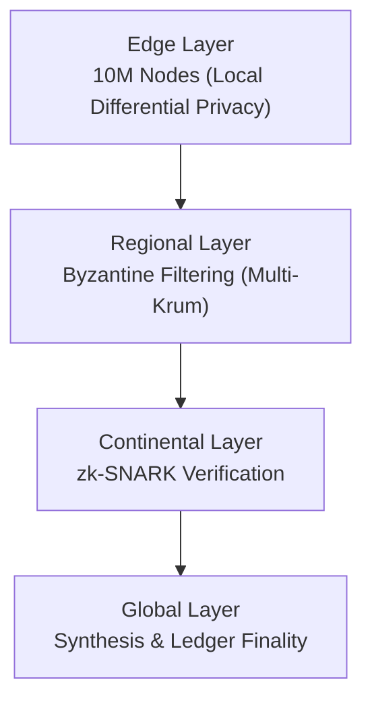
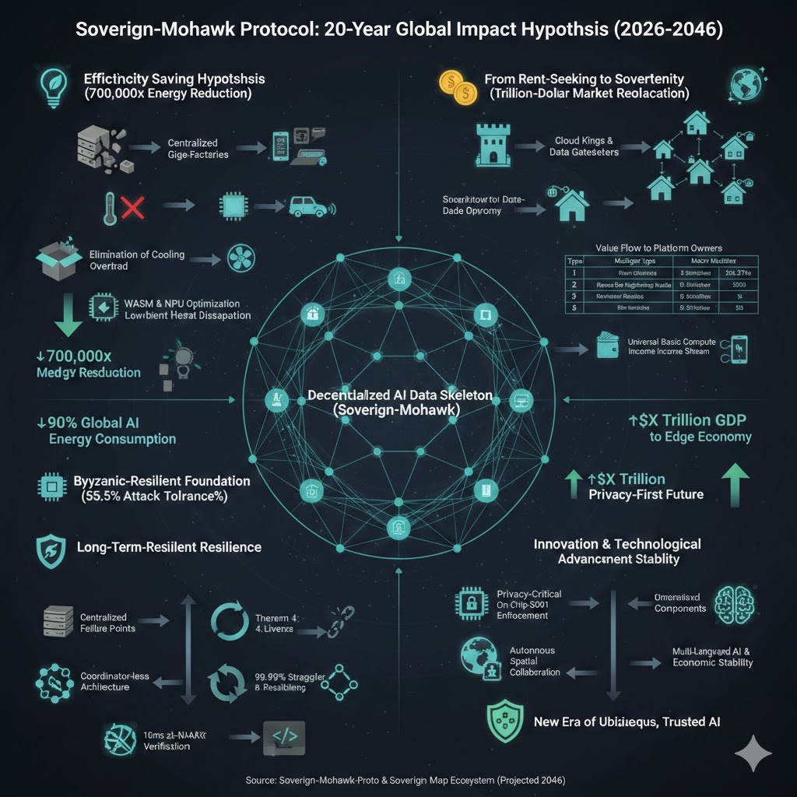

# Sovereign Mohawk Proto

**MOHAWK: Mobile Offloading Heterogenous Adaptive Weights for Knowledge**

[](https://github.com/rwilliamspbg-ops/Sovereign-Mohawk-Proto/releases)
[](https://github.com/rwilliamspbg-ops/Sovereign-Mohawk-Proto/actions/workflows/build-test.yml)
[](https://github.com/rwilliamspbg-ops/Sovereign-Mohawk-Proto/actions/workflows/go-test.yml)
[](https://github.com/rwilliamspbg-ops/Sovereign-Mohawk-Proto/actions/workflows/codeql-analysis.yml)
[](https://github.com/rwilliamspbg-ops/Sovereign-Mohawk-Proto/actions/workflows/security-audit-gate.yml)
[](https://github.com/rwilliamspbg-ops/Sovereign-Mohawk-Proto/actions/workflows/security-supply-chain.yml)
[](https://github.com/rwilliamspbg-ops/Sovereign-Mohawk-Proto/actions/workflows/verify-proofs.yml)
[](https://github.com/rwilliamspbg-ops/Sovereign-Mohawk-Proto/actions/workflows/workflow-action-pin-check.yml)
[](https://github.com/rwilliamspbg-ops/Sovereign-Mohawk-Proto/actions/workflows/release-performance-evidence.yml)
[](https://github.com/rwilliamspbg-ops/Sovereign-Mohawk-Proto/actions/workflows/mainnet-readiness-gate.yml)
[](https://github.com/rwilliamspbg-ops/Sovereign-Mohawk-Proto/actions/workflows/mainnet-chaos-gate.yml)
[](https://github.com/rwilliamspbg-ops/Sovereign-Mohawk-Proto/actions/workflows/ga-tag-safety.yml)
[](https://github.com/rwilliamspbg-ops/Sovereign-Mohawk-Proto/blob/main/go.mod)
[](https://pypi.org/project/mohawk/)
[](HARDWARE_COMPATIBILITY.md)
[](https://rwilliamspbg-ops.github.io/Sovereign-Mohawk-Proto/)
[](SECURITY.md)
[](SECURITY.md)
[](RELEASE_NOTES_PQC_OVERHAUL.md)
[](COMPLIANCE.md)
[](LICENSE.md)

Sovereign Mohawk Proto is a theorem-guided federated-learning runtime with Byzantine resilience, RDP privacy accounting, TPM-backed attestation, and deployable observability.

## Formal Verification Status

- Lean source of truth: [proofs/LeanFormalization.lean](proofs/LeanFormalization.lean)
- Theorem modules: [proofs/LeanFormalization/](proofs/LeanFormalization/)
- **Traceability matrix** (theorem claim → Lean module → runtime test evidence → status): [proofs/FORMAL_TRACEABILITY_MATRIX.md](proofs/FORMAL_TRACEABILITY_MATRIX.md) — _start here for a full audit trail of all 6 formally verified properties_
- Machine-checkable formal validation report: [results/proofs/formal_validation_report.json](results/proofs/formal_validation_report.json)
- Verification bundle manifest + archive: [results/proofs/formal-verification-bundle/bundle_manifest.json](results/proofs/formal-verification-bundle/bundle_manifest.json), [results/proofs/formal-verification-bundle.tar.gz](results/proofs/formal-verification-bundle.tar.gz)
- Independent verifier guide: [docs/FORMAL_VERIFICATION_GUIDE.md](docs/FORMAL_VERIFICATION_GUIDE.md)
- CI formal proof gates: [.github/workflows/verify-proofs.yml](.github/workflows/verify-proofs.yml) (`verify-lean-formalization`), [.github/workflows/verify-formal-proofs.yml](.github/workflows/verify-formal-proofs.yml)
- Mathlib disk-space safeguard in CI: both workflows run pre-build runner cleanup before Lean/Lake build steps
- Latest local verification log (build + placeholder scan): [proofs/manual_verify.log](proofs/manual_verify.log)

Formal report and bundle checks:

```bash
make refresh-formal-validation
make validate-formal
make validate-formal-tooling-tests
make validate-formal-container
make package-formal-verification-artifacts
```

## EU AI Act High-Risk Readiness

High-risk readiness controls, Article 8-15 mapping, technical evidence, and deployer logging guidance are documented in [COMPLIANCE.md](COMPLIANCE.md).

## Contributor Spotlight

- **Eddie Adams** ([`@Eddie-Adams`](https://github.com/Eddie-Adams))
- Recognized for the Apr 2026 security hardening patch set.
- Contribution focus: fail-closed verifier startup and constrained-runtime transport mitigation.
- Current awarded total: **1,000 points**.

## Quick Start (3 Nodes)

```bash
./genesis-launch.sh --all-nodes
docker compose ps
```

Stop stack:

```bash
docker compose down
```

## Flower + Mohawk In 30 Seconds

```bash
# from repo root
make build-python-lib
cd sdk/python
pip install -e .[flower]
python examples/flower_integrated/quickstart_pytorch.py --ci
```

For a live run that actually submits updates to aggregation, set `submit_updates=True` in your `MohawkFlowerClient` construction.

## TPM Production Closure (Signed Off)

Latest TPM production closure evidence (2026-04-11):

- Cross-platform matrix: [results/go-live/evidence/tpm_attestation_cross_platform_matrix_2026-04-11.md](results/go-live/evidence/tpm_attestation_cross_platform_matrix_2026-04-11.md)
- Closure validation: [results/go-live/evidence/tpm_attestation_closure_validation_2026-04-11.md](results/go-live/evidence/tpm_attestation_closure_validation_2026-04-11.md)
- Closure summary: [results/go-live/evidence/tpm_closure_summary_2026-04-11.md](results/go-live/evidence/tpm_closure_summary_2026-04-11.md)
- Attestation state (`approved`): [results/go-live/attestations/tpm_attestation_production_closure.json](results/go-live/attestations/tpm_attestation_production_closure.json)

## Published Router Integration Evidence

- Published Docker image integration validation: [results/go-live/evidence/router_integration_published_images_2026-04-11.md](results/go-live/evidence/router_integration_published_images_2026-04-11.md)

## Prominent Scaling Evidence

- Scaling evidence spotlight: [results/metrics/scaling_evidence_spotlight_2026-04-11.md](results/metrics/scaling_evidence_spotlight_2026-04-11.md)
- 500-node scale manifest: [captured_artifacts/500node_scale_test_manifest.json](captured_artifacts/500node_scale_test_manifest.json)
- Release performance evidence index: [results/metrics/release_performance_evidence.md](results/metrics/release_performance_evidence.md)

## Validation Notes

- Accelerator comparison artifacts are policy-driven backend profiles generated on the current host runtime. In this container, they are not device-attested NVIDIA, ROCm, or NPU measurements, so they should be read as supported-backend comparison evidence rather than hardware certification.
- TPM closure should be read as a two-step evidence chain: [results/go-live/evidence/tpm_attestation_closure_validation_2026-03-28.md](results/go-live/evidence/tpm_attestation_closure_validation_2026-03-28.md) captured an intermediate failure state, while [results/go-live/evidence/tpm_closure_summary_2026-03-28.md](results/go-live/evidence/tpm_closure_summary_2026-03-28.md) reflects the finalized approved closure with complete platform evidence.

## Artifact Governance

Generated artifacts are managed with retention + canonical-summary automation. Policy details are in [docs/ARTIFACT_GOVERNANCE.md](docs/ARTIFACT_GOVERNANCE.md).

```bash
make artifact-retention-dryrun
make artifact-retention-apply
make artifact-summary
```

## WSL2 Validation Overlay

For host-specific passthrough validation on Windows 11 with WSL2, keep the base compose stack portable and layer the device mappings with [docker-compose.wsl2.yml](docker-compose.wsl2.yml).

```bash
docker compose -f docker-compose.yml -f docker-compose.wsl2.yml up -d mohawk-validator
```

This overlay only works when the host actually exposes `/dev/tpmrm0` and `/dev/accel/accel0` inside WSL2. If those devices are absent, treat the run as unsupported on that machine rather than as a repo misconfiguration.

## Synthesize.bio Training

Use the demo wrapper to train from either a real synthesize.bio dataset export or a local CSV dump and write the report under `results/demo/synthesize_bio/`:

```bash
DATASET=https://app.synthesize.bio/datasets/<dataset-id> ./scripts/run_synthesizebio_demo.sh
# or
INPUT_CSV=/path/to/export.csv ./scripts/run_synthesizebio_demo.sh
```

For a Docker-native end-to-end run that starts the stack, trains, validates, and copies artifacts into the repo, use:

```bash
DATASET=https://app.synthesize.bio/datasets/<dataset-id> make demo-synthesizebio-docker VALIDATION_PROFILE=fast
```

## Security Defaults (Current)

- Proof verifier boot path is fail-closed by default; silent runtime disable is not allowed.
- Insecure verifier fallback is opt-in for CI/dev only with `MOHAWK_ALLOW_INSECURE_WASM_FALLBACK=true`.
- Privacy composition is standardized on RDP with fixed epsilon budget (`epsilon=2.0`) at runtime.
- Formal Byzantine checks are fail-closed in aggregator services when required inputs are missing.
- WASM static guardrails enforce size/function/import/local limits before module instantiation.
- Production TPM mode rejects software/fake fallback without required build tags.
- Deployment profile defaults to TCP-only libp2p by setting `MOHAWK_DISABLE_QUIC=true` in compose profiles, avoiding UDP buffer issues in constrained hosts.

## Most Used Commands

```bash
# Local mini sandbox
make sandbox-up
python3 tests/scripts/python/run_full_validation_suite.py --profile fast
make sandbox-down

# Full local 3-node stack
./scripts/launch_full_stack_3_nodes.sh --no-build

# Formal go-live checks
make go-live-gate-advisory
make golden-path-e2e
```

## Documentation Map

- Deployment flow: [DEPLOYMENT_GUIDE_GENESIS_TO_PRODUCTION.md](DEPLOYMENT_GUIDE_GENESIS_TO_PRODUCTION.md)
- Operations and incident response: [OPERATIONS_RUNBOOK.md](OPERATIONS_RUNBOOK.md)
- Performance benchmarking contract and regression policy: [PERFORMANCE.md](PERFORMANCE.md)
- Security policy and threat model: [SECURITY.md](SECURITY.md)
- EU AI compliance matrix (Articles 8-15): [COMPLIANCE.md](COMPLIANCE.md)
- QMS manual: [QMS_SYSTEM_MANUAL.md](QMS_SYSTEM_MANUAL.md)
- Technical documentation file structure: [TECHNICAL_DOCUMENTATION_FILE.md](TECHNICAL_DOCUMENTATION_FILE.md)
- Technical documentation template: [docs/tdf/TECHNICAL_FILE_TEMPLATE.md](docs/tdf/TECHNICAL_FILE_TEMPLATE.md)
- Cross-vertical federated router: [docs/CROSS_VERTICAL_FEDERATED_ROUTER.md](docs/CROSS_VERTICAL_FEDERATED_ROUTER.md)
- Artifact governance and retention policy: [docs/ARTIFACT_GOVERNANCE.md](docs/ARTIFACT_GOVERNANCE.md)
- Notified body early-engagement checklist: [docs/tdf/NOTIFIED_BODY_EARLY_ENGAGEMENT.md](docs/tdf/NOTIFIED_BODY_EARLY_ENGAGEMENT.md)
- Conformity assessment and CE path: [CONFORMITY_ASSESSMENT_AND_CE_PATH.md](CONFORMITY_ASSESSMENT_AND_CE_PATH.md)
- Post-market monitoring and incident reporting: [POST_MARKET_MONITORING_AND_INCIDENT_REPORTING.md](POST_MARKET_MONITORING_AND_INCIDENT_REPORTING.md)
- EU database registration plan: [EU_DATABASE_REGISTRATION_PLAN.md](EU_DATABASE_REGISTRATION_PLAN.md)
- Release checklist: [RELEASE_CHECKLIST_v1.0.0_RC.md](RELEASE_CHECKLIST_v1.0.0_RC.md)
- Roadmap and milestones: [ROADMAP.md](ROADMAP.md)
- Changelog: [CHANGELOG.md](CHANGELOG.md)

Naming context and attribution are documented in [NAMING.md](NAMING.md).

## 🧭 Hierarchy of Trust



Trust and verification harden as updates move upward from edge privacy-preserving clients to global finality.

---

## 🚀 Why Mohawk?

Traditional federated learning protocols struggle with linear scaling bottlenecks, brittle trust models, and limited runtime interoperability. Sovereign-Mohawk combines machine-checked Lean formalization workflows with deployment-grade runtime components so the protocol can be tested, monitored, and integrated instead of staying paper-only.

### 📊 Comparative Analysis

| Feature | NVIDIA FLARE | PySyft | **Sovereign-Mohawk** |
| :--- | :---: | :---: | :---: |
| **Lean Formalization + CI Gate** | Not presented | Not presented | **Yes (`proofs/LeanFormalization` + CI build/placeholder checks)** |
| **Byzantine Resilience Guarantee** | No published 55.5% theorem guarantee | No published 55.5% theorem guarantee | **55.5% (Theorem 1)** |
| **Targeted Scale Envelope** | Enterprise FL deployments | Research/privacy-focused FL workflows | **10M-node architecture target** |
| **Communication Complexity** | Aggregation-centric orchestration | Aggregation-centric orchestration | **$O(d \log n)$** |
| **PQC Enforcement (2026 Profile)** | No default hybrid KEX + XMSS + crypto-cutover profile | No default hybrid KEX + XMSS + crypto-cutover profile | **Default-enforced PQC profile** |
| **Proof Verification Path** | No native zk proof verification baseline | No native zk proof verification baseline | **zk-SNARK + STARK hybrid policy** |
| **Operational Readiness Gates** | Platform-dependent | Platform-dependent | **One-click readiness + chaos + digest artifacts** |

---

## 🎬 PySyft Integration Demo (5 Minutes)

Watch the short walkthrough showing MOHAWK orchestration + PySyft-style FL flow:

* Demo feed: [@RyanWill98382 on X](https://twitter.com/RyanWill98382)
* Search shortcut: [PySyft + Sovereign Mohawk demo posts](https://twitter.com/search?q=from%3ARyanWill98382%20PySyft%20Sovereign%20Mohawk&src=typed_query)

Preview graphic:



---

## ✨ Key Capabilities

* 🛡️ **Byzantine Fault Tolerance:** 55.5% resilience claim tracked in [proofs/bft_resilience.md](proofs/bft_resilience.md) and formalized in [proofs/LeanFormalization/Theorem1BFT.lean](proofs/LeanFormalization/Theorem1BFT.lean).
* 🐌 **Straggler Resilience:** 99.99% success-probability claim tracked in [internal/stragglers.md](internal/stragglers.md) and formalized in [proofs/LeanFormalization/Theorem4Liveness.lean](proofs/LeanFormalization/Theorem4Liveness.lean).
* ✅ **Instant Verifiability:** zk proof-path claim tracked in [proofs/cryptography.md](proofs/cryptography.md) and formalized in [proofs/LeanFormalization/Theorem5Cryptography.lean](proofs/LeanFormalization/Theorem5Cryptography.lean).
* 🐍 **Python SDK v2:** Accelerator, gradient, hybrid-proof, and utility-ledger helpers in the `mohawk` package.
* 🔀 **Hybrid Proof Policies:** Runtime selection for SNARK-only, STARK-backed, or hybrid verification modes.
* 💰 **Utility Coin Controls:** Persistent ledger snapshots, audit chaining, nonce replay protection, and role-gated admin operations.
* 🔁 **WASM Hash Registry + Hot Reload:** Content-addressed module loading with module-hash tracking in runtime status.
* 🧭 **Cross-Vertical Federated Router:** Policy-gated discovery, TPM-gated subscriptions, schema translation, and provenance chaining for inter-domain insight routing.
* 📊 **Tokenomics Monitoring:** Pre-provisioned Grafana dashboard for supply, holders, burn/mint dynamics, and proof cost.
* 📡 **Genesis Testnet:** Regional shard bootstrap with orchestrator, node-agent, metrics exporter, Prometheus, Grafana, and IPFS.
* ⚛️ **Quantum-Ready Controls:** Hybrid transport KEX policy, XMSS attestation mode, and dual-signature migration controls enabled in default deployment profiles.

### Quantum-Ready Defaults

Default stack profiles enforce these PQC-forward controls:

* `MOHAWK_TRANSPORT_KEX_MODE=x25519-mlkem768-hybrid`
* `MOHAWK_TPM_IDENTITY_SIG_MODE=xmss`
* `MOHAWK_PQC_MIGRATION_ENABLED=true`
* `MOHAWK_PQC_LOCK_LEGACY_TRANSFERS=true`
* `MOHAWK_PQC_MIGRATION_EPOCH=2027-12-31T00:00:00Z`
* `MOHAWK_PQC_REQUIRE_CRYPTO_AFTER_EPOCH=true`

Migration signing flow:

* Build canonical digest: `POST /ledger/migration/digest`
* Submit cryptographic transfer: `POST /ledger/migration/migrate`

Migration transfer supports cryptographic dual-signature fields:

* Legacy path: `legacy_algo`, `legacy_pub_key`, `legacy_sig`
* PQC path: `pqc_algo`, `pqc_pub_key`, `pqc_sig`

The canonical payload digest is produced by `MigrationSigningDigest(...)` in `internal/token`.

### Quantum-Proofing Primitives In Use

The current stack pairs classical and post-quantum controls so migration can happen with explicit cryptographic continuity:

* Transport key exchange: `x25519-mlkem768-hybrid` (classical ECDH + ML-KEM 768 hybrid).
* Attestation identity signatures: XMSS mode for TPM-backed identity metadata.
* Proof path for model verification: BN254 Groth16 zk-SNARK + SHA256 commitment-backed STARK transcript path.
* Migration signing: dual-signature transfer payloads (`legacy_*` + `pqc_*`) with epoch policy enforcement.

Reference docs:

* `RELEASE_NOTES_PQC_OVERHAUL.md`
* `SECURITY.md`
* `proofs/HUMAN_READABLE_PROOFS.md`

### PQC Readiness Overhaul (Major Release)

This release closes the 2026–2027 PQC readiness program from migration scaffolding to production enforcement:

Full release notes: [RELEASE_NOTES_PQC_OVERHAUL.md](RELEASE_NOTES_PQC_OVERHAUL.md)

* Hybrid transport negotiation is now policy-bound at runtime (`x25519-mlkem768-hybrid`) with keyshare-size enforcement.
* TPM quote identity is bound to XMSS-capable attestation metadata and payload digesting.
* Ledger migration cutover supports epoch-enforced cryptographic dual-signature transfers.
* Orchestrator exposes digest-first migration signing APIs for deterministic operator workflows.
* One-click readiness now emits structured PASS/FAIL pipeline artifacts with toolchain alignment metadata.

---

## 🛠️ Installation

### Go Runtime

Sovereign-Mohawk is built with **Go 1.25+**.

```bash
git clone https://github.com/rwilliamspbg-ops/Sovereign-Mohawk-Proto.git
cd Sovereign-Mohawk-Proto
go mod tidy
go build ./...
```

### Python SDK

The Python SDK provides a high-level interface to the MOHAWK runtime:

```bash
make build-python-lib
cd sdk/python
pip install -e .[dev]
python -c "import mohawk; print(mohawk.__version__)"
```

**Quick Python Example:**

```python
from mohawk import MohawkNode

node = MohawkNode()
result = node.start(config_path="capabilities.json", node_id="node-001")

proof = {"proof": "0x1234", "public_inputs": []}
verification = node.verify_proof(proof)

updates = [{"node_id": "n1", "gradient": [0.1, 0.2]}]
aggregation = node.aggregate(updates)

devices = node.device_info()
compressed = node.compress_gradients([0.1, 0.2, 0.3], format="fp16")

hybrid = node.verify_hybrid_proof(
    snark_proof="s" * 128,
    stark_proof="t" * 64,
    mode="both",
)

minted = node.mint_utility_coin(
    to="edge-alice",
    amount=100.0,
    actor="protocol",
    auth_token="my-service-token",
    idempotency_key="mint-001",
    nonce=1,
)

transferred = node.transfer_utility_coin(
    from_account="edge-alice",
    to_account="edge-bob",
    amount=25.0,
    memo="reward",
    auth_token="my-service-token",
    nonce=2,
)
```

See [sdk/python/README.md](sdk/python/README.md) for the complete API reference.

### Genesis Testnet

Validated startup options:

1. Regional profile (orchestrator + shard + node-agent-1):

```bash
./genesis-launch.sh

# Start orchestrator + shard + node-agent-1..3
./genesis-launch.sh --all-nodes

# Equivalent Make target
make regional-shard
```

1. Full local stack (orchestrator + 3 node agents):

```bash
./scripts/launch_full_stack_3_nodes.sh --no-build

# Equivalent Make target
make full-stack-3-nodes
```

Native PowerShell (Windows):

```powershell
Set-ExecutionPolicy -Scope Process -ExecutionPolicy Bypass
./scripts/launch_full_stack_3_nodes.ps1 -NoBuild
```

Startup checks validated in this repository:

* `./genesis-launch.sh` starts `orchestrator`, `shard-us-east`, `node-agent-1`, `prometheus`, `grafana`, `ipfs`, `tpm-metrics`.
* `./scripts/launch_full_stack_3_nodes.sh --no-build` starts `orchestrator`, `shard-us-east`, `node-agent-1..3`, `prometheus`, `grafana`, `ipfs`, `tpm-metrics`, `pyapi-metrics-exporter`.

Scalable full-stack profile (single `node-agent` service with replicas):

```bash
docker compose -f docker-compose.full.yml up -d --scale node-agent=10
```

For per-replica mTLS identities, ensure the cert pool size is >= replica count:

```bash
MOHAWK_TPM_CLIENT_CERT_POOL_SIZE=10 docker compose -f docker-compose.full.yml up -d --scale node-agent=10
```

`node-agent` replicas now fail fast at startup if their per-replica cert/key is missing.

Adding nodes after genesis start:

```bash
# Add node-agent-2 and node-agent-3 to an existing regional start
./scripts/docker-compose-wrapper.sh up -d node-agent-2 node-agent-3

# Equivalent direct Compose invocation
docker compose up -d node-agent-2 node-agent-3
```

Git Bash / Windows note:

* Use `./scripts/docker-compose-wrapper.sh ...` (with the `./scripts/` path).
* Running `docker-compose-wrapper.sh ...` without the path will fail with `command not found`.

Default endpoints after startup:

* Grafana: `http://localhost:3000`
* Prometheus: `http://localhost:9090`
* TPM metrics exporter: `http://localhost:9102/metrics`
* Orchestrator control plane: `https://localhost:8080` (mTLS enforced)

### Quick-Start Sandbox (Mini-Mohawk)

For a lightweight research/dev on-ramp, use the sandbox profile:

```bash
docker compose -f docker-compose.sandbox.yml up -d --build

# or use the wrapper script
./scripts/launch_sandbox.sh

# or use Make targets
make sandbox-up
```

Sandbox topology:

* 1 orchestrator (`orchestrator`)
* 1 shard (`shard-us-east`)
* 2 node agents (`node-agent-1`, `node-agent-2`)
* bundled Hello World FL WASM task build (`wasm-hello-world-build`)

Quick checks:

```bash
docker compose -f docker-compose.sandbox.yml ps
docker logs --tail=100 node-agent-1
docker logs --tail=100 node-agent-2
```

Stop sandbox:

```bash
docker compose -f docker-compose.sandbox.yml down

# or use the wrapper script
./scripts/launch_sandbox.sh --down

# or use Make targets
make sandbox-down
```

Local forensics drill:

```bash
make forensics-drill

# optional cleanup
make forensics-drill-down

# compact rehearsal (drill + automatic cleanup)
make forensics-rehearsal
```

Quick health checks:

```bash
curl -fsS http://localhost:3000/api/health
curl -fsS http://localhost:9090/-/healthy
curl -fsS http://localhost:9102/metrics | head
```

Control-plane mTLS verification (expected behavior):

```bash
# This should fail without a client certificate.
curl -kfsS https://localhost:8080/p2p/info || echo "expected: mTLS client certificate required"
```

The orchestrator control plane enforces client-certificate authentication. A plain curl without client cert should be rejected.

Windows troubleshooting for launcher secrets:

If Docker reports mount errors (`not a directory`) or token creation/permission failures, reset runtime secret paths and retry:

```bash
rm -rf runtime-secrets/mohawk_api_token runtime-secrets/mohawk_tpm_ca_cert.pem runtime-secrets/mohawk_tpm_ca_key.pem
docker compose down
./scripts/launch_full_stack_3_nodes.sh --no-build
```

PowerShell equivalent:

```powershell
Remove-Item -Recurse -Force .\runtime-secrets\mohawk_api_token, .\runtime-secrets\mohawk_tpm_ca_cert.pem, .\runtime-secrets\mohawk_tpm_ca_key.pem
docker compose down
.\scripts\launch_full_stack_3_nodes.ps1 -NoBuild
```

Stop the stack:

```bash
./scripts/launch_full_stack_3_nodes.sh --down

# Equivalent Make target
make full-stack-3-nodes-down
```

PowerShell stop:

```powershell
./scripts/launch_full_stack_3_nodes.ps1 -Down
```

Windows GUI launcher:

```bash
make testnet-gui-windows
```

That target builds `dist/windows/testnet-gui.exe`, which opens a native Windows desktop window for the testnet stack and reuses the checked-in Windows launcher script for start/stop actions. It also exposes quick links to Grafana, Prometheus, and the orchestrator control plane.

Grafana dashboard shortlist:

* `Sovereign Mohawk | Start Here`
* `Sovereign Mohawk | Operations Overview`
* `Sovereign Mohawk | Operations Incidents`
* `Sovereign Mohawk | Security & PQC Compliance`
* `Sovereign Mohawk | Engineering Latency Drilldown`
* `Sovereign Mohawk | Engineering Node Agents`
* `Sovereign Mohawk | Executive Summary`
* `MOHAWK Live Overview`
* `TPM Metrics`

v2 dashboard implementation and metric map:

* `monitoring/grafana/README.md`

Quick-import dashboard pack for fast local/testnet setup:

* `grafana/node-health-overview.json`
* `grafana/byzantine-detection.json`
* `grafana/tokenomics-flow.json`
* `grafana/README.md`

Forensics and hardware validation quick metric links (Prometheus):

* Honest ratio (10m min): `http://localhost:9090/graph?g0.expr=min_over_time(mohawk_consensus_honest_ratio%5B10m%5D)&g0.tab=0`
* Gradient failure ratio (5m): `http://localhost:9090/graph?g0.expr=(sum(rate(mohawk_accelerator_ops_total%7Boperation%3D%22gradient_submit%22%2Cresult%3D%22failure%22%7D%5B5m%5D))%2Fclamp_min(sum(rate(mohawk_accelerator_ops_total%7Boperation%3D%22gradient_submit%22%7D%5B5m%5D))%2C1e-9))&g0.tab=0`
* Proof verification p95 (10m): `http://localhost:9090/graph?g0.expr=histogram_quantile(0.95%2Csum(rate(mohawk_proof_verification_latency_ms_bucket%5B10m%5D))%20by%20(le))&g0.tab=0`
* TPM verification failures (10m increase): `http://localhost:9090/graph?g0.expr=increase(mohawk_tpm_verifications_total%7Bresult%3D%22failure%22%7D%5B10m%5D)&g0.tab=0`

### Weekly Readiness Digest Notifications (Optional)

The weekly digest workflow can post readiness/chaos summaries to Slack, Teams, and/or Discord.

Required repository secrets:

* `SLACK_WEBHOOK_URL`
* `TEAMS_WEBHOOK_URL`
* `DISCORD_WEBHOOK_URL`

Configure in GitHub:

1. Open **Settings → Secrets and variables → Actions**
2. Add one or more webhook secrets above
3. Run `Weekly Readiness Digest` manually (or wait for schedule) to verify delivery

Notes:

* If no webhook secret is set, notification step is skipped automatically.
* Slack/Teams receive payloads with `{"text": "..."}`; Discord receives payloads with `{"content": "..."}`.
* Discord messages are split into multiple posts to fit webhook content limits.
* Digest is always published to workflow summary and uploaded as an artifact.

### Utility Coin Runtime Controls

```bash
# Default utility coin ledger (MHC)
export MOHAWK_LEDGER_STATE_PATH="/var/lib/mohawk/mhc_state.json"
export MOHAWK_LEDGER_AUDIT_PATH="/var/lib/mohawk/mhc_audit.jsonl"
export MOHAWK_UTILITY_MINTER="protocol"

# Optional per-asset overrides remain available for utility coin deployments
export MOHAWK_LEDGER_STATE_PATH_MHC="/var/lib/mohawk/mhc_state.json"
export MOHAWK_LEDGER_AUDIT_PATH_MHC="/var/lib/mohawk/mhc_audit.jsonl"
```

Utility coin controls enforce:

* Persistent ledger state and append-only audit chaining when paths are configured.
* API token authorization for mint/transfer/burn operations when enabled.
* Role-based access control through the utility role policy variables.
* Refund-to-sender executes if destination release fails.

---

## 🧪 Testing & Compliance

This repository maintains strict adherence to the MOHAWK runtime specifications.

### Lint

Run all repository lint checks locally:

```bash
make lint
```

`make lint` runs `go fmt ./...` and `go vet ./...`.

### Go Runtime Tests

```bash
make test
make verify
go test ./...
```

Large-scale integration suite (500-1k swarm + Byzantine edge cases + backend profile checks):

```bash
go test ./test -run 'TestSwarmIntegration500To1000Nodes|TestByzantineEdgeCasesOver55PercentMalicious|TestHardwareAgnosticBackendProfiles'
```

### Python SDK Tests

```bash
make test-python-sdk
make demo-python-sdk
make python-all
```

### Production Readiness Check

Run the full production readiness gate (lint + tests + audit + strict auth/role smoke on host and container):

```bash
make production-readiness
```

### Formal Go-Live Gate

Run the formal production go-live gate validator (readiness + chaos + host tuning + mandatory attestation approvals):

```bash
make go-live-gate
```

Run explicit modes:

```bash
make go-live-gate-strict
make go-live-gate-advisory
```

Gate report artifact:

* `results/go-live/go-live-gate-report.json`

The report now includes `host_preflight_mode`, `warnings`, and enforcement state (`host_network_tuning_enforced`) so strict vs advisory execution is machine-auditable.

### Release Checklist (Operator Quick Run)

Use this compact sequence before release/tag cut:

1. Run strict formal gate on a production-tuned host:
    * `make go-live-gate-strict`
2. Run full golden path execution and evidence generation:
    * `make golden-path-e2e`
3. Run monitoring smoke checks (local equivalent of CI gate):
    * `docker compose up -d --build orchestrator alertmanager prometheus tpm-metrics pyapi-metrics-exporter grafana`
    * `curl -fsS http://localhost:9090/-/healthy`
    * `curl -fsS -u admin:admin 'http://localhost:3000/api/search?type=dash-db' | jq '.'`
4. Regenerate benchmark sign-off index:
    * `make release-performance-evidence`

Required evidence bundle:

* `results/go-live/go-live-gate-report.json`
* `results/go-live/strict-host-evidence.md`
* `results/go-live/golden-path-report.json`
* `results/go-live/golden-path-report.md`
* `results/metrics/release_performance_evidence.md`

Attestation inputs (must be `"status": "approved"` before go-live):

* `results/go-live/attestations/security_audit.json`
* `results/go-live/attestations/penetration_test.json`
* `results/go-live/attestations/threat_model_refresh.json`
* `results/go-live/attestations/dependency_sla_baseline.json`
* `results/go-live/attestations/backup_restore_drill.json`
* `results/go-live/attestations/soak_scale_rehearsal.json`
* `results/go-live/attestations/incident_escalation_drill.json`
* `results/go-live/attestations/runbook_published.json`

### One-Click Mainnet + PQC Contract Readiness

Run the full one-click pipeline (PQC config defaults, capability + contract policy gate, build/tests, strict auth, readiness gate, chaos drill, digest):

```bash
make mainnet-one-click
```

The one-click run now includes a host kernel UDP/socket preflight. If it fails, apply:

```bash
sudo sysctl -w net.core.rmem_max=8388608
sudo sysctl -w net.core.rmem_default=262144
sudo sysctl -w net.core.wmem_max=8388608
sudo sysctl -w net.core.wmem_default=262144
```

Persist these in `/etc/sysctl.conf` or `/etc/sysctl.d/*.conf`, then run `sudo sysctl --system`.

Host preflight mode defaults to strict in this release:

* Default (production): `MOHAWK_HOST_PREFLIGHT_MODE=strict`
* Dev-container override: `MOHAWK_HOST_PREFLIGHT_MODE=advisory make mainnet-one-click`

Artifacts are generated at:

* `results/readiness/readiness-report.json`
* `chaos-reports/tpm-metrics-summary.json`
* `results/readiness/readiness-digest.md`
* `results/go-live/go-live-gate-report.json`
* `results/go-live/golden-path-report.json`
* `results/go-live/golden-path-report.md`
* `results/go-live/attestations/`
* `PUBLIC_ARTIFACTS.md` (public, searchable artifact index)

---

## 📈 Benchmark Snapshot

Latest SDK benchmark snapshot from `sdk/python/tests/test_benchmarks.py` on March 14, 2026:

| Benchmark | Mean | Median | Throughput |
| --- | ---: | ---: | ---: |
| `test_verify_proof_performance` | 10.55 ms | 10.55 ms | 94.77 ops/s |
| `test_aggregate_nodes_performance` | 30.63 us | 25.20 us | 32,648 ops/s |
| `test_gradient_compression_performance` | 995.70 us | 944.57 us | 1,004 ops/s |

Reproduce locally:

```bash
cd sdk/python
python -m pytest tests/test_benchmarks.py --benchmark-only -q
```

### FedAvg Aggregation Benchmark Matrix (Go Runtime)

Latest runtime microbenchmark matrix for `AggregateParallel` includes:

* Workloads: `32x2048`, `128x4096`, `256x8192`, `512x8192`
* Worker configs: `workers1`, `workers2`, `workers4`, `workers8`, `workersAuto`

Run locally:

```bash
TOOLROOT=/go/pkg/mod/golang.org/toolchain@v0.0.1-go1.25.9.linux-amd64 \
GOROOT=$TOOLROOT PATH=$TOOLROOT/bin:$PATH GOTOOLCHAIN=local \
go test ./test -run '^$' -bench BenchmarkAggregateParallel -benchmem -benchtime=200ms
```

Generate a base-vs-current comparison report:

```bash
TOOLROOT=/go/pkg/mod/golang.org/toolchain@v0.0.1-go1.25.9.linux-amd64 \
BASE_REF=origin/main BENCH_TIME=200ms BENCH_COUNT=10 \
BENCH_CPU=2 \
USE_BENCHSTAT=always BENCHSTAT_ALPHA=0.01 \
REPORT_PATH=results/metrics/fedavg_benchmark_compare.md \
./scripts/benchmark_fedavg_compare.sh
```

This enforces `benchstat` output and uses a stricter significance threshold (`alpha=0.01`).

Comparison artifact:

* `results/metrics/fedavg_benchmark_compare.md`

FedAvg scaling controls and validation artifacts:

* Semi-async, hierarchical, and weighted-trim aggregation controls are available through the aggregation API and test harness.
* `make fedavg-scale-gate` validates throughput floors and pre/post counter deltas for the current runtime report.
* `captured_artifacts/fedavg_10k_node_runtime_evaluation_2026-04-13.md` captures the 10k-node runtime smoke evaluation and improvement notes.

CI baseline pinning behavior:

* On `main` pushes, workflow `FedAvg Benchmark Compare` captures and caches a benchmark baseline (`fedavg-main-*`) and uploads `fedavg-baseline-main`.
* On PRs, the same workflow restores the cached main baseline and diffs against PR benchmark output using `benchstat`.

### Scaled Swarm Runtime Benchmarks (500-1500 Node Profiles, Router-On)

Run the swarm runtime matrix workflow (safe and edge Byzantine profiles) and publish CI artifacts:

```bash
gh workflow run swarm-runtime-matrix.yml -f node_counts='500,1000,1500' -f safe_ratio='0.44' -f edge_ratio='0.56'
```

Published CI artifacts include:

* `test-results/swarm-runtime/scaled_swarm_benchmark_report.md`
* `test-results/swarm-runtime/scaled_swarm_benchmark_report.json`
* `test-results/swarm-runtime/router_smoke.txt`
* `test-results/swarm-runtime/router_metrics_snapshot.prom`
* per-profile JSONL traces in `test-results/swarm-runtime/*_{safe,edge}.jsonl`
* `results/metrics/fedavg_scale_gate_validation.md` and `results/metrics/fedavg_scale_gate_validation.json` are produced locally by the FedAvg scale gate validator.

### CPU vs GPU vs NPU Side-by-Side Benchmark

Run the hardware-policy benchmark report (used by CI and release assets):

```bash
make benchmark-gpu
```

Artifacts:

* `results/metrics/accelerator_backend_compare.md`
* `results/metrics/accelerator_backend_compare.json`

Live observability companion dashboard:

* `monitoring/grafana/dashboards/v2/v2-20-eng-latency-drilldown.json`

### Bridge Compression Benchmark (JSON vs Zero-Copy)

Run the bridge compression microbenchmark and generate a comparison report:

```bash
BENCH_TIME=200ms REPORT_PATH=results/metrics/bridge_compression_benchmark_compare.md \
BENCH_COUNT=5 BENCH_CPU=2 BENCHSTAT_ALPHA=0.01 \
./scripts/benchmark_bridge_compression_compare.sh
```

This report is a JSON-vs-zero-copy format comparison on the same commit, not a base-ref regression diff.

Artifacts:

* `results/metrics/bridge_compression_benchmark_compare.md`
* `results/metrics/bridge_compression_benchmark_raw.txt`

CI baseline pinning behavior:

* On `main` pushes, workflow `Bridge Compression Benchmark` stores the raw benchmark output as cache (`bridge-main-*`) and uploads `bridge-baseline-main`.
* On PRs, the same workflow restores the cached main baseline and generates regression evidence in `bridge-compression-regression-report` (`results/metrics/bridge_compression_regression_compare.md`).

### Release Performance Evidence Index

Build a release-grade performance evidence index from benchmark artifacts:

```bash
make release-performance-evidence
```

Artifact:

* `results/metrics/release_performance_evidence.md`

---

## 🛡️ Verification & Monitoring

The system leverages a proof-driven monitoring strategy and production CI gates.

### GitHub Actions

All production-grade safety requirements are verified on every push:

* **Build and Test:** Go build/test, Wasm module build, capability validation, and Docker stack config.
* **Integrity Guard - Linter:** `golangci-lint`, `black --check`, and targeted `flake8` validation.
* **Local Toolchain Consistency:** Run `make go-env` before local Go lint/test commands to confirm `go` and `compile` resolve to the same toolchain root.
* **Performance Gate:** Benchmark regression checks for proof verification, aggregation, and gradient compression.
* **Swarm Runtime Matrix:** 500/1000/1500-node safe+edge Byzantine runtime profiles with router-on preflight evidence and published artifacts.
* **FedAvg Benchmark Compare:** Go runtime FedAvg benchmark matrix diff against base branch with markdown artifact upload.
* **FedAvg Scale Gate:** Validates FedAvg throughput floors, runtime-report coverage, and counter deltas for async/semi-async tuning runs.
* **Bridge Compression Benchmark:** JSON-vs-zero-copy bridge compression benchmark report with artifact upload.
* **Monitoring Smoke Gate:** Compose-based Prometheus/Grafana health and dashboard registration checks.
* **Release Performance Evidence:** Aggregates benchmark artifacts into a release sign-off index.
* **Release Assets and Images:** Builds release bundles with SBOMs, benchmark reports, downloadable OCI archives, and GHCR-published tagged images.
* **Byzantine Forensics Weekly:** Runs Mini-Mohawk sandbox, extracts rejected-gradient forensics report, computes baseline deltas, and publishes artifacts.
* **Byzantine Forensics Daily Short-Run:** Lightweight daily window with stricter alert threshold for faster anomaly detection.
* **Forensics Automation Smoke:** Pull-request guard for forensics scripts/workflows and Make target command resolution.

Quick green-board verification command:

```bash
gh run list --limit 20 --json workflowName,conclusion,status \
| jq -r '.[] | "\(.workflowName): \(.status)/\(.conclusion // "in_progress")"'
```

Optional issue-routing variables for forensics threshold breaches:

* `BYZANTINE_FORENSICS_ISSUE_LABELS` (comma-separated labels, default: `security,operations,automated-alert`)
* `BYZANTINE_FORENSICS_ISSUE_ASSIGNEES` (comma-separated GitHub usernames)
* `BYZANTINE_FORENSICS_AUTO_CLOSE_HEALTHY_RUNS` (integer streak target, default: `3`)

Behavior notes:

* Breach issues are deduplicated per profile (`daily-short` vs `weekly`) and updated via comments.
* The workflow auto-applies a profile label (`byzantine-forensics-daily-short` or `byzantine-forensics-weekly`) on breach.
* Open breach issues are auto-closed after the configured count of consecutive healthy runs for the same profile.
* **Proof-Driven Design Verification:** Capability and proof audit via `scripts/audit_proofs.sh`.
* **Capability Sync Check:** Runtime capability manifest validation.

### Branch Protection Baseline

Recommended protected-branch policy for `main` requires the release and safety gates listed above.

Admin automation helper (requires repo-admin token permissions):

```bash
bash scripts/apply_branch_protection.sh
```

### Observability Stack

* [monitoring/prometheus/prometheus.yml](monitoring/prometheus/prometheus.yml)
* [monitoring/alertmanager/alertmanager.yml](monitoring/alertmanager/alertmanager.yml)
* [monitoring/grafana/dashboards/](monitoring/grafana/dashboards/)
* [grafana/](grafana/)
* [monitoring/grafana/README.md](monitoring/grafana/README.md)
* [cmd/tpm-metrics/main.go](cmd/tpm-metrics/main.go)

### Release and CI Artifacts

Stable release tags now attach a downloadable artifact bundle with:

* GHCR-published tagged images (`orchestrator`, `node-agent`, `fl-aggregator`, `api-dashboard`)
* OCI image archives and image digest files
* Source + image SBOMs (SPDX JSON)
* Runtime benchmark reports
* `sovereign-map-testnet.tar.gz`
* npm package tarballs when package manifests are present

CI workflow runs now upload:

* `test-results/` output bundle
* Swarm integration suite outputs
* Benchmark markdown/json artifacts
* Downloadable CI OCI image archives

---

## 📦 Repository Structure

```text
Sovereign-Mohawk-Proto/
├── cmd/                    # Main application entry points
│   ├── orchestrator/      # Control plane + mTLS endpoint
│   ├── node-agent/        # Edge node runtime + libp2p transport
│   └── tpm-metrics/       # Prometheus exporter
├── internal/               # Core Go implementation
│   ├── accelerator/       # Device detection + quantization
│   ├── bridge/            # Route policy engine and typed proofs
│   ├── hva/               # Hierarchical planning logic
│   ├── hybrid/            # Hybrid SNARK/STARK verification
│   ├── ipfs/              # Checkpoint backend
│   ├── network/           # libp2p transport and gradient protocol
│   ├── pyapi/             # Python SDK C-shared library exports
│   ├── token/             # Utility coin ledger
│   ├── tpm/               # TPM attestation + mTLS
│   └── wasmhost/          # WebAssembly runtime
├── monitoring/            # Prometheus and Grafana assets
├── sdk/
│   └── python/
│       ├── mohawk/        # Python package
│       ├── examples/      # Usage examples
│       └── tests/         # Unit tests and benchmarks
├── proofs/                # Formal verification documents
├── scripts/               # Build, audit, and smoke-test scripts
├── wasm-modules/          # fl_task, flower_task, pytorch_task
└── README.md
```

---

## 🎯 What's New in This Release

### Platform Upgrade (v2.0.1.Alpha)

✨ **New Features:**

* Python SDK v2 with accelerator, bridge, gradient, hybrid-proof, and utility-ledger APIs.
* libp2p gradient transport between node-agents and orchestrator.
* Route-policy bridge verification with default manifest fallback.
* TPM-backed mTLS control plane and strict auth smoke validation.
* Prometheus/Grafana observability stack and genesis testnet bootstrap.

🔧 **Technical Details:**

* Exported Go bridge now includes proof batching, hybrid verification, bridge transfer, device info, gradient compression, and utility-ledger operations.
* Python package version: `2.0.1.Alpha`.
* Strict CI gates: build/test, linter, performance gate, capability sync, proof audit, and pages deploy.
* Benchmarked SDK mean latencies: 10.55 ms verify, 30.63 us aggregate, 995.70 us compression.

📚 **Documentation:**

* [sdk/python/README.md](sdk/python/README.md)
* [sdk/python/mohawk/client.py](sdk/python/mohawk/client.py)
* [sdk/python/examples/](sdk/python/examples/)
* [monitoring/prometheus/prometheus.yml](monitoring/prometheus/prometheus.yml)
* [monitoring/grafana/dashboards/](monitoring/grafana/dashboards/)

See [CHANGELOG.md](CHANGELOG.md) for full release history.

---

## 🗺️ Roadmap

See [ROADMAP.md](ROADMAP.md) for detailed feature timeline and development priorities.

### Current Phase: v1.0.0 GA Closure (Q2 2026)

**Program Stage:** Go-Live Formalization Complete

**Next Up:**

* Release-owner approval and v1.0.0 GA tag cut
* Publish TPM sign-off bundle archive as GA release asset
* Post-GA operational cadence and ecosystem expansion milestones

---

## 📖 Documentation

* [WHITE_PAPER.md](WHITE_PAPER.md) - Protocol design and architecture
* [ACADEMIC_PAPER.md](ACADEMIC_PAPER.md) - Theorem statements and derivations
* [proofs/LeanFormalization/](proofs/LeanFormalization/) - Lean machine-checked formalization modules
* [proofs/FORMAL_TRACEABILITY_MATRIX.md](proofs/FORMAL_TRACEABILITY_MATRIX.md) - Claim-to-proof-to-test traceability
* [sdk/python/README.md](sdk/python/README.md) - Python SDK guide
* [CONTRIBUTING.md](CONTRIBUTING.md) - Development guidelines
* [sdk/python/mohawk/client.py](sdk/python/mohawk/client.py) - Python client API reference
* [OPERATIONS_RUNBOOK.md](OPERATIONS_RUNBOOK.md) - Production operations runbook
* [HARDWARE_COMPATIBILITY.md](HARDWARE_COMPATIBILITY.md) - TPM/HSM compatibility matrix and 10 ms validation criteria
* [EDGE_LITE_RESOURCE_PROFILE.md](EDGE_LITE_RESOURCE_PROFILE.md) - Lite node resource floors and profiling guidance
* [COMPLIANCE_MAPPING.md](COMPLIANCE_MAPPING.md) - HIPAA/GDPR control mapping for healthcare deployments
* [CERTIK_AUDIT_SUMMARY.md](CERTIK_AUDIT_SUMMARY.md) - Redacted external-audit findings and mitigation summary
* [DEPLOYMENT_GUIDE_GENESIS_TO_PRODUCTION.md](DEPLOYMENT_GUIDE_GENESIS_TO_PRODUCTION.md) - Genesis-to-production rollout guide
* [RELEASE_CHECKLIST_v1.0.0_RC.md](RELEASE_CHECKLIST_v1.0.0_RC.md) - v1.0.0 release candidate sign-off checklist
* [proofs/HUMAN_READABLE_PROOFS.md](proofs/HUMAN_READABLE_PROOFS.md) - Operator-focused proof interpretation workflow
* [proofs/pyapi_bridge_auth_denial.md](proofs/pyapi_bridge_auth_denial.md) - Formal proof sketch for bridge auth denial semantics
* [proofs/THINKER_CLAUSES_CAPABILITIES.md](proofs/THINKER_CLAUSES_CAPABILITIES.md) - Thinker Clause edge-case configuration guidance
* [results/go-live/go-live-gate-report.json](results/go-live/go-live-gate-report.json) - Formal go-live gate status report
* [results/go-live/strict-host-evidence.md](results/go-live/strict-host-evidence.md) - Strict production-host gate evidence and tuning checklist
* [results/go-live/go-live-gate-report.json](results/go-live/go-live-gate-report.json) - Strict-mode go-live gate report after host tuning
* [results/go-live/golden-path-report.md](results/go-live/golden-path-report.md) - End-to-end golden path execution summary
* [captured_artifacts/ga_release_readiness_2026-04-17.md](captured_artifacts/ga_release_readiness_2026-04-17.md) - Consolidated GA readiness evidence report
* [captured_artifacts/release_package_manifest_checksums_2026-04-17.txt](captured_artifacts/release_package_manifest_checksums_2026-04-17.txt) - Release package checksum record
* [results/go-live/evidence/slo_sli_baseline_2026-03-28.md](results/go-live/evidence/slo_sli_baseline_2026-03-28.md) - Versioned SLO/SLI definitions for Phase 3 closure
* [results/go-live/evidence/failure_injection_latency_validation_2026-03-28.md](results/go-live/evidence/failure_injection_latency_validation_2026-03-28.md) - Failure-injection latency validation report
* [results/go-live/evidence/tpm_attestation_cross_platform_matrix_2026-03-28.md](results/go-live/evidence/tpm_attestation_cross_platform_matrix_2026-03-28.md) - TPM production-closure cross-platform validation matrix
* [results/go-live/evidence/tpm_attestation_closure_validation_2026-03-28.md](results/go-live/evidence/tpm_attestation_closure_validation_2026-03-28.md) - TPM closure validator status report
* [results/go-live/evidence/tpm_attestation_local_sandbox_2026-03-29.md](results/go-live/evidence/tpm_attestation_local_sandbox_2026-03-29.md) - Local sandbox TPM/forensics validation snapshot for Mini-Mohawk profile
* [results/go-live/evidence/tpm_closure_summary_2026-03-28.md](results/go-live/evidence/tpm_closure_summary_2026-03-28.md) - TPM closure dashboard summary
* [results/go-live/evidence/forensics_rehearsal_validation_2026-03-29.md](results/go-live/evidence/forensics_rehearsal_validation_2026-03-29.md) - Day 2 forensics and recovery rehearsal validation record
* [results/go-live/evidence/release_candidate_evidence_checkpoint_2026-03-29.md](results/go-live/evidence/release_candidate_evidence_checkpoint_2026-03-29.md) - Consolidated release-candidate evidence checkpoint index
* [results/go-live/strict-host-evidence.md](results/go-live/strict-host-evidence.md) - Strict-host go-live baseline and environment hardening evidence
* [results/go-live/evidence/templates/windows_tpm_attestation_capture_guide.md](results/go-live/evidence/templates/windows_tpm_attestation_capture_guide.md) - Windows TPM evidence capture guide
* [results/go-live/evidence/templates/macos_tpm_attestation_capture_guide.md](results/go-live/evidence/templates/macos_tpm_attestation_capture_guide.md) - macOS TPM evidence capture guide
* [results/go-live/evidence/templates/hardware_validation_capture_template.md](results/go-live/evidence/templates/hardware_validation_capture_template.md) - Standardized hardware validation capture template
* [results/metrics/release_performance_evidence.md](results/metrics/release_performance_evidence.md) - Release benchmark evidence index

PQC migration and transport helper scripts:

* `python scripts/pqc_migration_payload_cli.py --help`
* `python scripts/validate_transport_kex_mode.py --help`
* `python scripts/render_human_readable_proof.py --help`
* `python scripts/validate_tpm_attestation_closure.py --help`
* `python scripts/generate_tpm_closure_summary.py --help`
* `python scripts/enforce_ga_tag_safety.py --tag v1.0.0`
* `bash scripts/quantum_kex_rotation_drill.sh --help`
* `bash scripts/extract_byzantine_forensics.sh --help`
* `bash scripts/launch_sandbox.sh --help`
* `make sandbox-up`
* `make sandbox-down`
* `make forensics-rehearsal`

---

## 🤝 Contributing

We welcome contributions! Please see [CONTRIBUTING.md](CONTRIBUTING.md) for:

* Development setup
* Code style guidelines
* Testing requirements
* Pull request process

---

## 📜 License

This project is licensed under the **Apache License 2.0**. See the [LICENSE.md](LICENSE.md) file for details.

IP Notice: Portions of protocol technology are marked **Patent Pending** (U.S. provisional filing, March 2026). This notice is informational and does not modify Apache-2.0 terms.

For a consolidated legal summary, see [NOTICE.md](NOTICE.md).

---

## 🔗 Links

* **GitHub:** [Sovereign-Mohawk-Proto](https://github.com/rwilliamspbg-ops/Sovereign-Mohawk-Proto)
* **Twitter/X:** [@RyanWill98382](https://twitter.com/RyanWill98382)
* **Issues:** [Report a Bug](https://github.com/rwilliamspbg-ops/Sovereign-Mohawk-Proto/issues)
* **Discussions:** [Community Forum](https://github.com/rwilliamspbg-ops/Sovereign-Mohawk-Proto/discussions)

---

## Addendum: Human Impact & Governance Sovereignty

1. The Paradox of the Sovereign Protocol
While the Sovereign Mohawk Protocol is designed to be "Sovereign"—meaning it operates via decentralized consensus rather than centralized human authority—this creates a risk of Technological Determinism.

A system that answers to no one can inadvertently become a "Master" rather than a tool. We explicitly recognize that mathematical verification does not equal moral justification. A protocol may be "correct" in its execution of code while being "wrong" in its impact on human free will.

1. The "Seventh Theorem": Resistance to Commercial Capture
Current BFT (Byzantine Fault Tolerance) models focus on "liars" (adversarial nodes). We propose a transition toward defending against "owners" (economic consolidation).

Transparency of the Genesis Block: To prevent the Genesis Block from becoming a "Digital Board of Directors," the selection criteria for the initial 1,000 nodes must be publicly auditable, diverse in geography, and inclusive of non-commercial stakeholders.

The Anti-Greed Protocol: We must implement decay functions on node influence to ensure that "Health and Wealth" promises do not lead to a "lock-in" effect where users trade long-term agency for short-term convenience.

1. Protecting the "Thinker" over the "Consensus"
Standard Federated Learning prunes outliers to achieve accuracy. However, in human systems, the "outlier" is often the innovator or the dissenter.

Dissensus Preservation: The protocol shall include "Thinker Clauses" that prevent the automatic suppression of minority data paths, ensuring that "Sovereignty" includes the right to deviate from the planetary norm.

Legibility of the Sovereign Map: The "Sovereign Map" must not remain a black box. We commit to developing "Human-Readable Proofs" where the logic of the network is accessible to the average person, not just the cryptographer.

1. Accountability in Scaleless Systems
As the system scales toward 100M+ nodes, traditional regulation becomes functionally impossible.

Algorithmic Recourse: Every automated decision within the protocol must have a defined path for human appeal, ensuring that "messy" free will remains the final fail-safe against "perfect" algorithmic errors.

Privacy as Agency: Privacy in this network is not a "shield for owners" but a sanctuary for the individual. It must be architected to protect the user from the network owners, not the owners from public scrutiny.

### Final Declaration

We build this protocol to serve humanity, not to replace its judgment. The messiness of human choice is the only metric that cannot be optimized, and it is the only metric that matters.

---
*Built for the future of Sovereign AI.*

## Prior Art & Novelty Statement

This project publicly discloses (since [earliest commit date, e.g., early 2026]) a novel combination of hierarchical federated learning with zk-SNARK verifiable aggregation, 55.5% Byzantine resilience, 99.99% straggler tolerance, and extreme metadata compression at planetary scale. The repository includes Lean formalization artifacts and CI machine-check gates for the tracked theorem set; see [proofs/LeanFormalization/](proofs/LeanFormalization/) and [proofs/FORMAL_TRACEABILITY_MATRIX.md](proofs/FORMAL_TRACEABILITY_MATRIX.md). Public commits and X posts (@RyanWill98382) serve as timestamped evidence.
